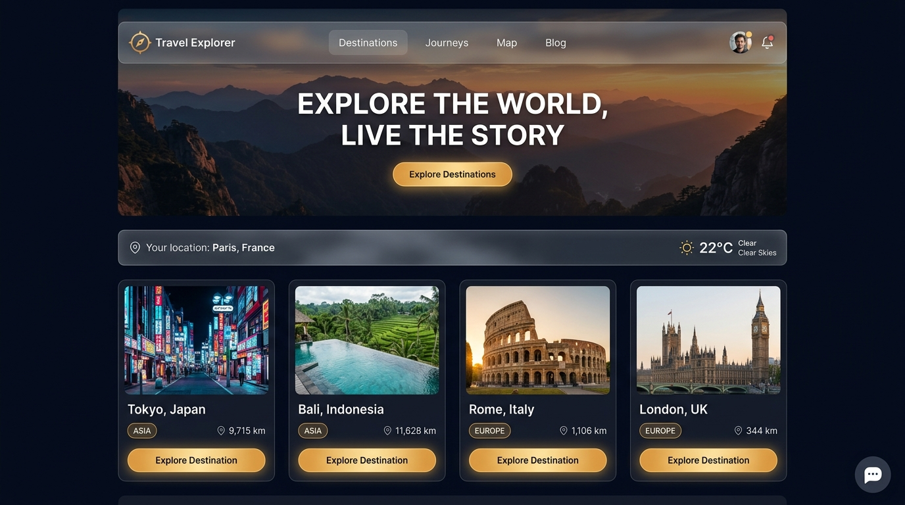
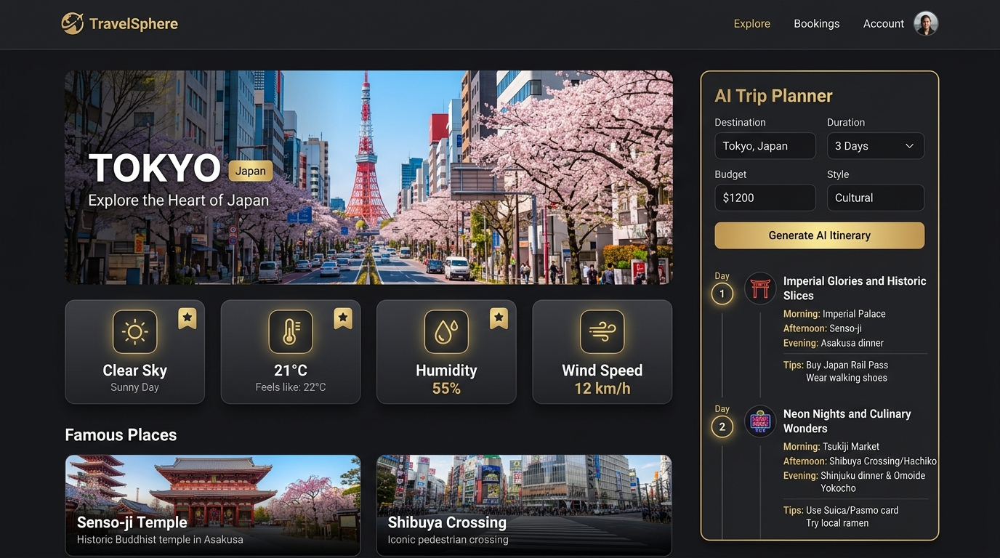

# 🌍 Travel Explorer

> An intelligent, design-led travel web application built with **React**, **Vite**, **Express**, and **Google Gemini AI**. Explore breathtaking destinations around the globe, check live weather, discover famous landmarks, calculate real-time distances, and generate personalized day-by-day travel itineraries with an interactive AI assistant.

---

## 📸 Application Preview

### Home Landing & Destination Explorer


### Destination Details, Live Weather & AI Trip Planner


---

## 🚀 Features Built

### 1. 🎬 Cinematic Landing Experience
- Looping HD video background (`public/videos/travel-video.mp4`) with smooth dark gradient overlay and fallback CSS animation.
- Modern typography using Google Fonts (*Playfair Display* & *Inter*).
- Fluid hero CTA with smooth scroll navigation and scroll cue indicator.

### 2. 🧭 Destination Explorer & Instant Filtering
- Browse **16 hand-curated destinations** across 6 continents (*Asia, Europe, North America, South America, Africa, Oceania*).
- Real-time search by city or country with instant result filtering and clear search button.
- Continent category filter pills with active state indicators.
- Symmetrical destination cards with hover lift animations and glowing **"Explore Destination →"** CTA buttons.

### 3. 🏛️ Famous Places Showcase
- Each destination features its most notable landmarks (e.g. *Eiffel Tower, Senso-ji Temple, Colosseum, Tanah Lot, Burj Khalifa*).
- Presented with dedicated photography, category tags (*Landmark, Culture, Nature, Modern*), and informative descriptions.

### 4. 📍 Location Awareness & Real-Time Distance
- One-click GPS location detection using the browser **Geolocation API**.
- Graceful permission fallback with a manual city search bar powered by **Open-Meteo Geocoding** with debounced autocomplete.
- Automatically calculates and displays real-time distance in kilometers (e.g., `6.8k km`) from the user's location to each destination using the **Haversine formula**.
- Displays current local temperature and conditions in the top location bar.

### 5. ⛅ Live Weather Integration
- Fetches real-time weather data from the **Open-Meteo API** (temperature, WMO weather codes, day/night awareness).
- Symmetrical 4-card dashboard layout displaying:
  - **Condition**: Dynamic icon with human-readable condition (*Clear sky, Partly cloudy, Rain, etc.*).
  - **Temperature**: Current temperature in °C and *"Feels like"* reading.
  - **Humidity**: Relative atmospheric moisture percentage.
  - **Wind Speed**: Real-time velocity in km/h.

### 6. 🖼️ Reliable Image Pipeline with Offline Fallbacks
- Dual-provider image architecture (Unsplash Search API with optional Pexels fallback).
- Client-side `localStorage` caching with a 24-hour TTL to prevent redundant network calls.
- High-definition Unsplash CDN fallback layer ensuring authentic travel photos always display even if external search APIs hit rate limits.

### 7. 🤖 AI Travel Assistant (Chatbot)
- Floating contextual AI chatbot powered by **Google Gemini**.
- Context-aware: Automatically absorbs the destination the user is currently viewing to deliver tailored suggestions, safety tips, best seasons to visit, and local insights.
- Quick-prompt suggestion chips for instant travel questions.

### 8. 📅 AI Day-by-Day Trip Planner
- Custom itinerary generator powered by Google Gemini with structured JSON output.
- Configurable by destination, trip duration (1 to 7 days), budget, interests, and travel style (*Cultural, Adventure, Relaxation, Foodie, Romantic, Budget*).
- Renders a clean visual timeline with numbered day badges, categorized morning/afternoon/evening plans, estimated daily costs, and practical local tips.

### 9. 📱 Full Mobile Responsiveness
- Collapsible navigation drawer with smooth backdrop blur for mobile viewports.
- Touch-friendly full-width action buttons on all destination cards.
- AI Chatbot automatically expands into a full-screen mobile app experience on screens under 500px.

---

## 🌐 External APIs Used

| API | Provider | Purpose | Authentication |
| :--- | :--- | :--- | :--- |
| **Open-Meteo Weather API** | [Open-Meteo](https://open-meteo.com/) | Real-time weather, temperature, humidity, wind | Free (No key required) |
| **Open-Meteo Geocoding API** | [Open-Meteo](https://open-meteo.com/en/docs/geocoding-api) | City search & coordinates resolution | Free (No key required) |
| **OpenStreetMap Nominatim** | [OpenStreetMap](https://nominatim.org/) | Reverse geocoding for GPS coordinates | Free (No key required) |
| **Unsplash API** | [Unsplash Developers](https://unsplash.com/developers) | Dynamic destination and landmark photography | Free API Key |
| **Google Gemini API** | [Google AI Studio](https://aistudio.google.com/) | AI Chatbot & Itinerary Generator | Free API Key |

---

## 🛠️ Tech Stack & Architecture

- **Frontend**: React 18, Vite 8, Vanilla CSS (Design Tokens, Glassmorphism, CSS Grid & Flexbox)
- **Icons**: Lucide React
- **Backend**: Node.js, Express, CORS
- **AI Engine**: Google Generative AI SDK (`@google/generative-ai`) featuring an automatic multi-model fallback cascade (`gemini-3.5-flash` → `gemini-3.7-flash` → `gemini-flash-latest`) for 100% uptime
- **Serverless**: Netlify Functions for zero-backend production deployment

---

## 📁 Repository Structure

```text
travel-explorer/
├── docs/
│   └── screenshots/
│       ├── home-explorer.jpg      # Home & Explorer screenshot
│       └── details-planner.jpg    # Details & AI Planner screenshot
├── netlify/
│   └── functions/
│       ├── chat.js                # Serverless AI Chat function
│       └── generate-itinerary.js  # Serverless AI Itinerary function
├── public/
│   ├── favicon.svg                # Custom compass favicon
│   └── videos/
│       └── travel-video.mp4       # Hero background video
├── server/
│   ├── index.js                   # Local Express server with Gemini cascade
│   ├── package.json
│   ├── .env                       # Backend secrets (git-ignored)
│   └── .env.example
├── src/
│   ├── components/
│   │   ├── AIChatbot.jsx / .css
│   │   ├── DestinationCard.jsx / .css
│   │   ├── DestinationDetails.jsx / .css
│   │   ├── Footer.jsx / .css
│   │   ├── Hero.jsx / .css
│   │   ├── LocationBar.jsx / .css
│   │   ├── Navbar.jsx / .css
│   │   └── TripPlanner.jsx / .css
│   ├── data/
│   │   └── destinations.js        # 16 destinations with landmarks & metadata
│   ├── services/
│   │   ├── geminiService.js       # AI API client (dev localhost & prod serverless)
│   │   ├── locationService.js     # Geolocation & Haversine formula
│   │   ├── unsplashService.js     # Dual-source image fetcher & cache
│   │   └── weatherService.js      # Open-Meteo client
│   ├── App.jsx
│   ├── index.css                  # Design system tokens & global styling
│   └── main.jsx
├── .env.example
├── .gitignore
├── index.html
├── netlify.toml                   # Netlify build & serverless redirects
├── package.json
└── vite.config.js
```

---

## 💻 How to Run Locally

### 1. Prerequisites
- [Node.js](https://nodejs.org/) (v18 or higher)
- [npm](https://www.npmjs.com/) (installed with Node)
- A free Google Gemini API key from [Google AI Studio](https://aistudio.google.com/)
- *(Optional)* An Unsplash API key from [Unsplash Developers](https://unsplash.com/developers)

---

### 2. Installation

Clone the repository and install dependencies:

```bash
# Clone the repository
git clone https://github.com/YOUR_USERNAME/travel-explorer.git
cd travel-explorer

# Install frontend dependencies
npm install

# Install backend dependencies
cd server
npm install
cd ..
```

---

### 3. Configure Environment Variables

**Frontend (`.env` in root folder):**
```env
VITE_UNSPLASH_ACCESS_KEY=your_unsplash_access_key
VITE_PEXELS_API_KEY=your_pexels_key_optional
VITE_API_URL=http://localhost:5000
```

**Backend (`server/.env`):**
```env
GEMINI_API_KEY=your_google_gemini_api_key
PORT=5000
```

---

### 4. Start the Application

Run the backend and frontend in two separate terminals:

**Terminal 1 — Start the Backend Server:**
```bash
cd server
npm start
```
*Backend runs on `http://localhost:5000`.*

**Terminal 2 — Start the Frontend Dev Server:**
```bash
npm run dev
```
*Frontend runs on `http://localhost:5173`.*

Open **[http://localhost:5173](http://localhost:5173)** in your browser!

---

## ☁️ Deploying to Netlify (1-Click Fullstack)

This repository includes native **Netlify Serverless Functions**, so you can deploy both frontend and backend to Netlify without needing an external server:

1. Push your code to GitHub:
   ```bash
   git add .
   git commit -m "docs: add full README and preview screenshots"
   git push origin main
   ```
2. In [Netlify](https://app.netlify.com/), click **"Add new site"** → **"Import an existing project"** → select your repo.
3. Netlify automatically reads `netlify.toml` (Build: `npm run build`, Publish: `dist`, Functions: `netlify/functions`).
4. Under **Site configuration** → **Environment variables**, add:
   - `GEMINI_API_KEY`: *(Your Google Gemini key)*
   - `VITE_UNSPLASH_ACCESS_KEY`: *(Your Unsplash key)*
5. Click **Deploy Site**!

---

## 📄 License
This project is open-source and available under the [MIT License](LICENSE).
